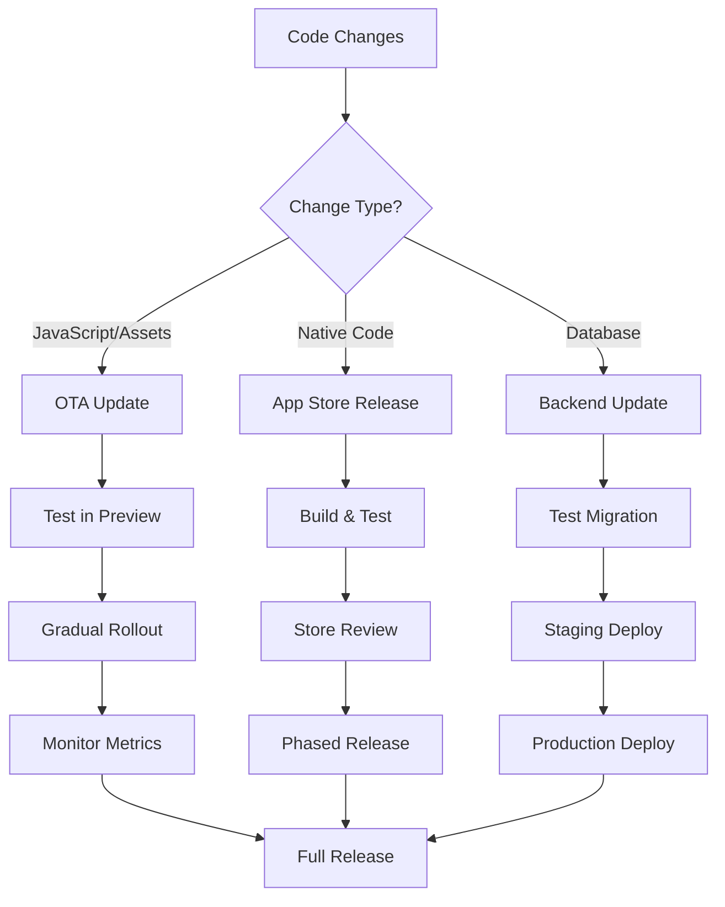

# ICYPAA Mobile App - Deployment Guide

## Table of Contents
1. [Deployment Overview](#deployment-overview)
2. [Update Types & Requirements](#update-types--requirements)
3. [Over-the-Air Updates (OTA)](#over-the-air-updates-ota)
4. [Native App Store Releases](#native-app-store-releases)
5. [Database & Backend Updates](#database--backend-updates)
6. [Feature Flags & Remote Config](#feature-flags--remote-config)
7. [Deployment Workflows](#deployment-workflows)
8. [Rollback Procedures](#rollback-procedures)
9. [Monitoring & Validation](#monitoring--validation)
10. [Emergency Procedures](#emergency-procedures)

## Deployment Overview

The ICYPAA mobile app uses a multi-tiered deployment strategy that allows for different types of updates based on the scope and nature of changes:

```
┌─────────────────────────────────────────────────────────────┐
│                    Update Types                              │
├─────────────────────────────────────────────────────────────┤
│  1. Over-the-Air (OTA) Updates - JavaScript/Assets          │
│     └─ Delivered via Expo Updates (immediate)               │
│                                                              │
│  2. Native Updates - Binary changes                         │
│     └─ Delivered via App Store/Play Store (1-3 days)       │
│                                                              │
│  3. Backend Updates - Database/API changes                  │
│     └─ Deployed to Supabase (immediate)                     │
│                                                              │
│  4. Feature Flags - Feature toggles                         │
│     └─ Updated via remote config (immediate)                │
└─────────────────────────────────────────────────────────────┘
```

## Update Types & Requirements

### 📱 What Requires a Full App Store Release

A new app store release is **required** for:

#### Native Code Changes
- ✅ New native dependencies (`npm install` of native modules)
- ✅ Changes to native configurations:
  - `app.json` (certain fields)
  - `Info.plist` (iOS)
  - `AndroidManifest.xml` (Android)
- ✅ Expo SDK upgrades
- ✅ React Native version updates
- ✅ Changes to app permissions
- ✅ Changes to app icon or splash screen
- ✅ Build configuration changes
- ✅ Native module modifications

#### Examples requiring native release:
```json
// app.json changes that require native build:
{
  "expo": {
    "ios": {
      "bundleIdentifier": "...",  // ❌ Cannot change via OTA
      "buildNumber": "...",        // ❌ Requires new build
      "infoPlist": { ... }         // ❌ Native configuration
    },
    "android": {
      "package": "...",            // ❌ Cannot change via OTA
      "versionCode": ...,          // ❌ Requires new build
      "permissions": [...]         // ❌ Native permissions
    },
    "plugins": [...]               // ❌ Native plugins
  }
}
```

### 🔄 What Can Be Updated via OTA (Expo Updates)

Over-the-air updates can deliver:

#### JavaScript Code Changes
- ✅ Component updates
- ✅ Business logic changes
- ✅ Bug fixes in JS code
- ✅ New screens/features (JS only)
- ✅ Style and layout changes
- ✅ API endpoint updates
- ✅ State management changes

#### Asset Updates
- ✅ Images (in assets folder)
- ✅ Fonts
- ✅ JSON data files
- ✅ Translation files
- ✅ Sound files

#### Configuration Changes
- ✅ Environment variables (in code)
- ✅ Feature flags (hardcoded)
- ✅ API URLs (if not native)

#### Examples of OTA-compatible changes:
```typescript
// ✅ Can update via OTA:
// Component changes
export const ProfileScreen = () => {
  // New feature or bug fix
  return <View>...</View>;
};

// Business logic
export const calculateDiscount = (price: number) => {
  // Updated calculation
  return price * 0.9;
};

// Styles
const styles = StyleSheet.create({
  container: {
    backgroundColor: '#new-color' // ✅ Can change
  }
});
```

### 🗄️ What Can Be Updated via Database/Backend

Backend updates are delivered immediately:

#### Database Schema Changes
- ✅ New tables
- ✅ New columns (with defaults)
- ✅ New indexes
- ✅ Row Level Security policies
- ✅ Database functions
- ✅ Triggers

#### API Changes
- ✅ Edge Functions
- ✅ Webhooks
- ✅ Authentication rules
- ✅ Storage policies

#### Content Updates
- ✅ Event schedules
- ✅ Venue information
- ✅ Service details
- ✅ FAQ content
- ✅ Announcements

## Over-the-Air Updates (OTA)

### Configuration

```json
// app.json
{
  "expo": {
    "updates": {
      "enabled": true,
      "checkAutomatically": "ON_LOAD",
      "fallbackToCacheTimeout": 3000,
      "url": "https://u.expo.dev/[project-id]"
    },
    "runtimeVersion": {
      "policy": "sdkVersion"
    }
  }
}
```

### Publishing OTA Updates

```bash
# 1. Test the update locally
npm run start

# 2. Build and test on device
eas build --platform all --profile preview

# 3. Publish OTA update
eas update --branch production --message "Fix: Schedule display issue"

# 4. Monitor rollout
eas update:list --branch production
```

### OTA Update Channels

```bash
# Production channel (all users)
eas update --branch production

# Beta channel (beta testers)
eas update --branch beta

# Internal channel (development team)
eas update --branch internal
```

### Update Rollout Strategy

```typescript
// Gradual rollout with monitoring
const publishUpdate = async () => {
  // 1. Internal testing (1% of users)
  await publish({ branch: 'internal', percentage: 1 });
  await monitor(1_hour);
  
  // 2. Beta rollout (10% of users)
  await publish({ branch: 'beta', percentage: 10 });
  await monitor(6_hours);
  
  // 3. Staged production (50% of users)
  await publish({ branch: 'production', percentage: 50 });
  await monitor(24_hours);
  
  // 4. Full rollout (100% of users)
  await publish({ branch: 'production', percentage: 100 });
};
```

## Native App Store Releases

### iOS App Store Release

```bash
# 1. Update version and build number
# app.json
{
  "expo": {
    "version": "1.2.0",
    "ios": {
      "buildNumber": "1.2.0.1"
    }
  }
}

# 2. Build for App Store
eas build --platform ios --profile production

# 3. Submit to App Store
eas submit --platform ios --latest

# 4. Complete App Store Connect submission
# - Add release notes
# - Submit for review
# - Monitor review status
```

### Android Play Store Release

```bash
# 1. Update version and version code
# app.json
{
  "expo": {
    "version": "1.2.0",
    "android": {
      "versionCode": 120001
    }
  }
}

# 2. Build for Play Store
eas build --platform android --profile production

# 3. Submit to Play Store
eas submit --platform android --latest

# 4. Complete Play Console submission
# - Add release notes
# - Submit for review
# - Staged rollout (optional)
```

### Version Numbering Strategy

```
Major.Minor.Patch.Build

1.2.3.4
│ │ │ └─ Build number (increments each build)
│ │ └─── Patch version (bug fixes)
│ └───── Minor version (new features)
└─────── Major version (breaking changes)
```

## Database & Backend Updates

### Safe Database Migrations

```sql
-- Always use transactions for schema changes
BEGIN;

-- Add new column with default (safe)
ALTER TABLE events 
ADD COLUMN IF NOT EXISTS featured BOOLEAN DEFAULT false;

-- Add index concurrently (non-blocking)
CREATE INDEX CONCURRENTLY IF NOT EXISTS idx_events_featured 
ON events(featured) WHERE featured = true;

-- Update RLS policies
CREATE POLICY events_featured_select ON events
  FOR SELECT USING (featured = true OR auth.role() = 'admin');

COMMIT;
```

### Backward Compatible Changes

✅ **Safe to deploy immediately:**
```sql
-- Adding nullable columns
ALTER TABLE users ADD COLUMN preferences JSONB;

-- Adding new tables
CREATE TABLE announcements (...);

-- Adding new functions
CREATE FUNCTION get_featured_events() ...;

-- Adding indexes
CREATE INDEX CONCURRENTLY ...;
```

❌ **Requires coordinated deployment:**
```sql
-- Dropping columns
ALTER TABLE users DROP COLUMN old_field;

-- Renaming columns
ALTER TABLE users RENAME COLUMN name TO full_name;

-- Changing column types
ALTER TABLE events ALTER COLUMN start_time TYPE TIMESTAMPTZ;

-- Removing tables
DROP TABLE old_data;
```

### Database Update Workflow

```bash
# 1. Test migration locally
supabase db reset
supabase migration new add_featured_events
# Edit migration file
supabase migration up

# 2. Apply to staging
supabase db push --db-url $STAGING_DB_URL

# 3. Validate in staging
npm run test:integration:staging

# 4. Apply to production
supabase db push --db-url $PRODUCTION_DB_URL

# 5. Verify production
npm run test:smoke:production
```

## Feature Flags & Remote Config

### Feature Flag Implementation

```typescript
// lib/featureFlags.ts
export const FEATURE_FLAGS = {
  SCHEDULE_SHARING: 'schedule_sharing',
  HOSPITALITY_UPDATES: 'hospitality_updates',
  PUSH_NOTIFICATIONS: 'push_notifications',
  CHILD_CARE_BOOKING: 'child_care_booking',
  VOLUNTEER_SIGNUP: 'volunteer_signup'
};

// Check feature availability
const isFeatureEnabled = async (flag: string): Promise<boolean> => {
  const { data } = await supabase
    .from('feature_flags')
    .select('enabled')
    .eq('flag_name', flag)
    .single();
  
  return data?.enabled ?? false;
};
```

### Remote Configuration Updates

```sql
-- Enable/disable features without app update
UPDATE feature_flags 
SET enabled = true, 
    updated_at = NOW()
WHERE flag_name = 'schedule_sharing';

-- A/B testing configuration
UPDATE feature_flags 
SET config = jsonb_build_object(
  'rollout_percentage', 50,
  'target_users', ARRAY['beta_testers']
)
WHERE flag_name = 'new_feature';
```

## Deployment Workflows

### Standard Release Process



### Hotfix Process

```bash
# 1. Create hotfix branch
git checkout -b hotfix/critical-bug main

# 2. Apply fix
# ... make changes ...

# 3. Test thoroughly
npm test
npm run test:e2e

# 4. Deploy based on fix type:

# JavaScript fix - OTA update
eas update --branch production --message "Hotfix: Critical bug"

# Native fix - Expedited review
eas build --platform all --profile production
eas submit --platform all --latest
# Request expedited review in store consoles

# Database fix - Immediate deploy
supabase migration new hotfix_critical
supabase db push --db-url $PRODUCTION_DB_URL
```

## Rollback Procedures

### OTA Update Rollback

```bash
# 1. Republish previous working version
eas update --branch production --clear-cache

# 2. Or point to previous update
eas channel:edit production --update [previous-update-id]

# 3. Force clients to fetch update
# Users will get the rollback on next app launch
```

### Database Rollback

```sql
-- Always prepare rollback scripts
-- rollback_migration.sql
BEGIN;

-- Reverse schema changes
ALTER TABLE events DROP COLUMN IF EXISTS featured;
DROP INDEX IF EXISTS idx_events_featured;
DROP POLICY IF EXISTS events_featured_select ON events;

COMMIT;

-- Apply rollback
-- supabase db push --db-url $PRODUCTION_DB_URL < rollback_migration.sql
```

### App Store Rollback

```bash
# iOS: Cannot directly rollback - must submit new version
# Prepare emergency release
git checkout last-stable-tag
# Increment version
# Build and submit with expedited review

# Android: Can halt staged rollout
# 1. Halt rollout in Play Console
# 2. Prepare fixed version
# 3. Submit new release
```

## Monitoring & Validation

### Pre-Deployment Checklist

```markdown
## Before OTA Update
- [ ] All tests passing
- [ ] Tested on physical devices
- [ ] Performance benchmarks acceptable
- [ ] No console errors or warnings
- [ ] Accessibility checks passed
- [ ] Translations updated

## Before Native Release
- [ ] Version numbers updated
- [ ] Release notes prepared
- [ ] Screenshots updated (if UI changed)
- [ ] App store metadata current
- [ ] Certificates valid
- [ ] Privacy policy updated (if needed)

## Before Database Update
- [ ] Migration tested locally
- [ ] Rollback script prepared
- [ ] Backup created
- [ ] Staging validation complete
- [ ] Performance impact assessed
- [ ] RLS policies tested
```

### Post-Deployment Monitoring

```typescript
// Monitor key metrics after deployment
const monitorDeployment = async () => {
  const metrics = {
    crashRate: await Sentry.getCrashRate(),
    apiErrors: await getAPIErrorRate(),
    userSessions: await getActiveUsers(),
    updateAdoption: await getUpdateAdoptionRate(),
    performance: await getPerformanceMetrics()
  };
  
  // Alert if thresholds exceeded
  if (metrics.crashRate > 0.01) { // 1% crash rate
    await alertTeam('High crash rate detected');
    await initiateRollback();
  }
};
```

### Success Metrics

```typescript
interface DeploymentMetrics {
  updateAdoptionRate: number;    // Target: >90% in 24h
  crashFreeRate: number;          // Target: >99.5%
  apiSuccessRate: number;         // Target: >99.9%
  averageStartupTime: number;     // Target: <2s
  userRetention: number;          // Target: >80%
}
```

## Emergency Procedures

### Critical Issue Response

```bash
# 1. Assess severity
# P0: App unusable, data loss risk
# P1: Major feature broken
# P2: Minor feature issue
# P3: Cosmetic issue

# 2. P0/P1 Response:
# Immediately:
- Alert on-call engineer
- Create incident channel
- Begin investigation

# Within 15 minutes:
- Identify root cause
- Decide: rollback or hotfix

# Within 1 hour:
- Deploy fix or rollback
- Notify affected users

# 3. Communication
- Status page update
- In-app notification (if possible)
- Discord announcement
```

### Emergency Contacts

```yaml
escalation_chain:
  - role: On-Call Engineer
    contact: Use PagerDuty
    
  - role: Tech Lead
    contact: tech-lead@icypaa.org
    
  - role: Product Owner
    contact: product@icypaa.org
    
support_channels:
  sentry: https://sentry.io/organizations/icypaa
  supabase: https://app.supabase.com/support
  expo: https://expo.dev/contact
  aws: AWS Support Console
```

### Disaster Recovery

```bash
# Complete app failure recovery

# 1. Revert to last known good state
git checkout last-stable-tag

# 2. Emergency OTA update
eas update --branch production --clear-cache --message "Emergency rollback"

# 3. Database recovery (if needed)
# Restore from automated backup
supabase db restore --backup-id [backup-id]

# 4. Clear CDN caches
# CloudFlare or CDN provider dashboard

# 5. Communicate with users
# - Push notification
# - Email blast
# - Social media update
```

## Deployment Schedule

### Regular Release Cadence

```
Around Conference:
- OTA updates for bug fixes
- Database content updates
- Native app store releases
- Major feature launches

Quarterly:
- SDK/Framework upgrades
- Security updates
- Performance optimizations
```

### Blackout Periods

```
Avoid deployments during:
- Conference week (no updates 3 days before - 3 days after)
```

## Summary Quick Reference

| Change Type | Deployment Method | Time to Users | Rollback Capability |
|------------|------------------|---------------|-------------------|
| JS/React Code | OTA Update | Immediate-24h | Easy (republish) |
| Assets/Images | OTA Update | Immediate-24h | Easy (republish) |
| Native Modules | App Store | 1-7 days | Difficult (new version) |
| Permissions | App Store | 1-7 days | Difficult (new version) |
| Database Schema | Direct Deploy | Immediate | Medium (migration) |
| API/Edge Functions | Direct Deploy | Immediate | Easy (redeploy) |
| Feature Flags | Database Update | Immediate | Easy (toggle) |
| Content | Database Update | Immediate | Easy (update) |

### Decision Tree

```
Is it a native code change?
├─ Yes → App Store Release Required
└─ No → Is it a database schema change?
    ├─ Yes → Database Migration (test carefully)
    └─ No → Is it JavaScript/assets?
        ├─ Yes → OTA Update
        └─ No → Feature flag or content update
```